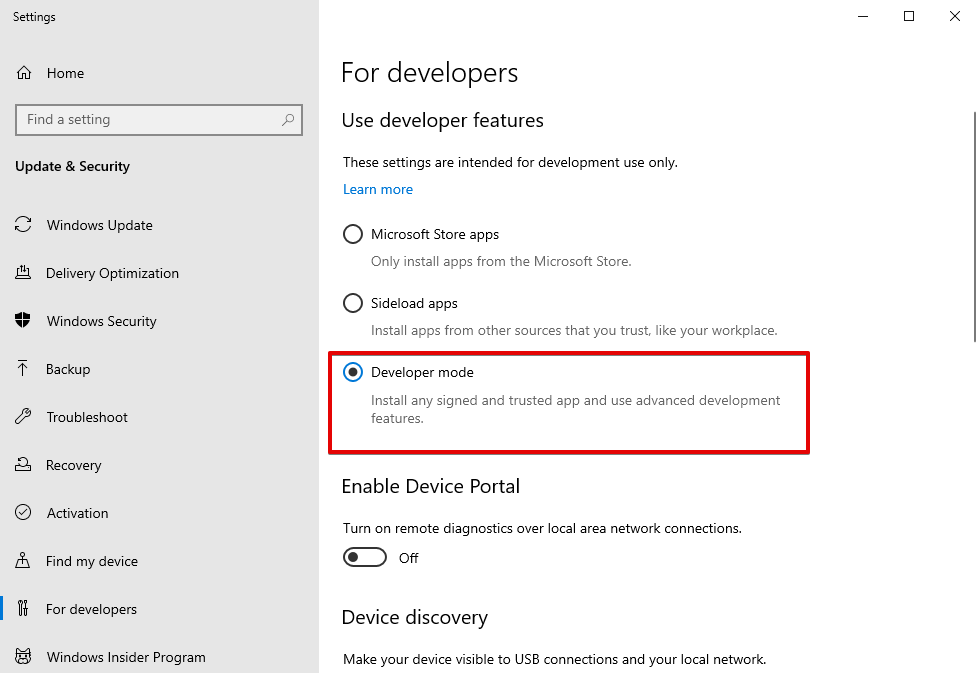

## Practice DirectX12

## Examples
- Simple
- Gaussian Blur

## How to run
1. Clone

```
git clone https://github.com/Ushio/DirectX12_Example.git
git submodule update --init
```

2. run premake

```
git clone 
premake5 vs2019
```

2. open with visual studio 2019
3. Tools / Command Line / Developer Command Prompt

```
cd DirectX12_Example
ruby compileshader.rb
```

4. Build & Run

## How to use pix for windows
1. Open Pix for windows
2. Set Path to executable in Launch Win32 ( bin\Gaussian.exe or bin\Simple.exe)
3. Press Launch
4. Press GPU Capture
5. Press captures taken: 

## note
You might need to set developer mode.


If you use a nvidia card, you also have to enable its developer setting like this.
https://developer.nvidia.com/nvidia-development-tools-solutions-ERR_NVGPUCTRPERM-permission-issue-performance-counters

## references (Thanks)
[DirectX 12の魔導書 3Dレンダリングの基礎からMMDモデルを踊らせるまで]( https://www.amazon.co.jp/DirectX-12%E3%81%AE%E9%AD%94%E9%81%93%E6%9B%B8-3D%E3%83%AC%E3%83%B3%E3%83%80%E3%83%AA%E3%83%B3%E3%82%B0%E3%81%AE%E5%9F%BA%E7%A4%8E%E3%81%8B%E3%82%89MMD%E3%83%A2%E3%83%87%E3%83%AB%E3%82%92%E8%B8%8A%E3%82%89%E3%81%9B%E3%82%8B%E3%81%BE%E3%81%A7-%E5%B7%9D%E9%87%8E-%E7%AB%9C%E4%B8%80/dp/4798161934 )

